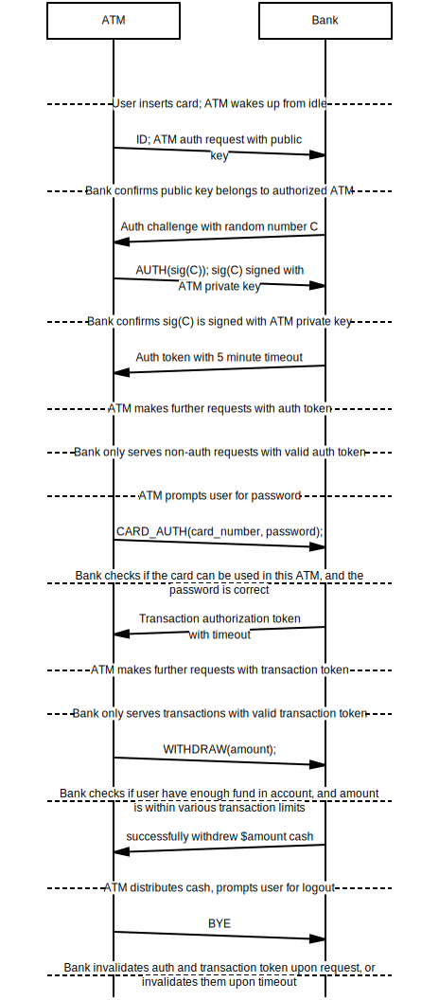

# CS3251 HW1

Dezhi Fang, dezhifang@gatech.edu, 903133949, dfang30

## Table of Contents

[TOC]

## Problems

### Problem 1

`WebATM` Protocol extends `HTTP` protocol by adding the following verbs: `ID`, `AUTH`, `CARD_AUTH`, `AMOUNT`, `WITHDRAW`and `BYE`. `WebATM` also defines several headers used in the process: `AUTH_TOKEN` and `TRANSACTION_TOKEN`. `WebATM` should only be used with `HTTPS` with strict cryptography verification. ATMs must not proceed with any further actions should the Bank fails the verification.

#### Headers

- `AUTH_TOKEN`: Authentication token Bank replied to the ATM upon the ATM successfully verifies its identity (that the ATM is a Bank authorized device). By default, times out in 5 minutes.
  - These verbs will only be processed with a valid `AUTH_TOKEN` header: `CARD_AUTH`, `AMOUNT`, `WITHDRAW` and `BYE`.
  - This token establishes the ATM's identity.
- `TRANSACTION_TOKEN`: Authentication token Bank replied to the ATM upon the ATM authenticates a credit card with its password. By default, times out in 5 minutes.
  - These verbs will only be processed with a valid `TRANSACTION_TOKEN` header: `AMOUNT` and `WITHDRAW` .
  - This token authorizes the ATM to perform transactions on a user's account.

#### Verbs

- `ID`: ATM sends this request with its public key.
  - Upon receiving this request, the bank verifies if the ATM is authorized. 
    - If authorized, replies with an authentication challenge (ramdom number) `C`.
- `AUTH`: ATM sends this request with authentication challenge `C` signed with its private key, `sig(C)`.
  - Upon receiving this request, the bank verifies that `sig(C)` is actually signed with the ATM's private key. 
    - If confirmed, replies ATM with `AUTH_TOKEN` .
- `CARD_AUTH`: ATM sends this request with header `AUTH_TOKEN`, card number and user's password input.
  - Upon receiving this request, the bank verifies if the card number and password correctly authenticates the user. 
    - If confirmed, replies ATM with `TRANSACTION_TOKEN` that authorizes the ATM of transaction on the user's account.
    - If not verified, replies ATM with an error.
- `AMOUNT`: ATM sends this request with header `AUTH_TOKEN` and `TRANSACTION_TOKEN`.
  - Upon receiving this request, the bank replies with the amount of funds available in the card associated with `TRANSACTION_TOKEN`.
- `WITHDRAW`: ATM sends this request with header `AUTH_TOKEN` and `TRANSACTION_TOKEN`, and with the amount requested by user.
  - Upon receiving the request, the bank first checks if the user's account has more available funds than requested by the user and the amount is within transaction limits.
    - If the check fails, respond the user with an error.
    - If the check succeeds, decrement the user's account with the amount requested, and responds the client with the amount successfully withdrew.
- `BYE`: ATM sends this request with header `AUTH_TOKEN` and, optionally,  `TRANSACTION_TOKEN`.
  - Upon receiving the request, the bank invalidates the `AUTH_TOKEN` and `TRANSACTION_TOKEN` if they are not already timed out.




### Problem 7

Time to encode first packet: $56 bytes / (64000bps / 8) = 7ms$

Time to transmit a packet: $56 \times 8 / (2 \times 10^6) sec = 224\mu s$

Total delay: $7ms + 10ms + 224\mu s=17.224ms$.

### Problem 8

1. 20 users
2. $0.1$
3. $C(120, n)(0.1)^n(0.9)^{120 - n}$
4. $1 - \sum^{20}_{n=0}C(120, n)(0.1)^n(0.9)^{120 - n}$

### Problem 18

For detailed trace logging, see [Appendix A](#appendix-a). Traces are done in an AWS EC2 server in `us-east-1` towards Google Public DNS (`8.8.8.8`).

| Trace   | Mean    | Stddev  | Number of Routers |
| ------- | ------- | ------- | ----------------- |
| Trace 1 | 9.309   | 0.02052 | 15 (16 - 1)       |
| Trace 2 | 9.14633 | 0.14238 | 16 (17 - 1)       |
| Trace 3 | 9.43733 | 0.17753 | 16 (17 - 1)       |

Number of routers changed from the second trace.

### Problem 22

1. $(1 - p)^N$
2. $\frac{1}{(1 - p)^N} - 1$

### Problem 23

1. $L/R_s$
2. ​
   1. Yes. If the first packet haven't finished transmitting in $R_c$ while the second packet arrives at the router, the second packet could be queued. 
   2. Time for router to transmit the first packet: $L/R_c$. Time for server to transmit the second packet: $L/R_s$. Answer: $L/R_c - L/R_s$.

### Problem 31

1. $\frac{8 \times 10^6}{2 \times 10^6} \times 3 = 12s$
2. ​
   1. $\frac{10^4}{2 \times 10^6}s = 5ms$
   2. $\frac{10^4}{2 \times 10^6}s \times 2 = 10ms$
3. $\frac{8 \times 10^6}{2 \times 10^6}s + 2 \times 5ms = 4.01s$. Similar to pipelining, segmentation is able to fully utilize the network by having multiple packets on the wire at a given time. Segmentation significantly improves the time to transmit large messages.

### Problem 33

Time to send = $(cell(\frac{F}{S}) + 2) \times \frac{80 + S}{R})$ => $S=\sqrt{40F}$

## Appendix A

### Traceroute logs

#### Trace 1, 7PM Sep 8

```
traceroute to 8.8.8.8 (8.8.8.8), 30 hops max, 60 byte packets
 1  216.182.226.44 (216.182.226.44)  11.454 ms 216.182.224.138 (216.182.224.138)  20.640 ms 216.182.226.38 (216.182.226.38)  19.083 ms
 2  100.66.12.144 (100.66.12.144)  14.788 ms 100.66.8.58 (100.66.8.58)  17.798 ms 100.66.12.212 (100.66.12.212)  19.180 ms
 3  100.66.14.86 (100.66.14.86)  17.062 ms 100.66.14.230 (100.66.14.230)  41.476 ms 100.66.14.2 (100.66.14.2)  16.025 ms
 4  100.66.7.225 (100.66.7.225)  15.793 ms 100.66.6.203 (100.66.6.203)  16.647 ms 100.66.6.195 (100.66.6.195)  21.768 ms
 5  100.66.4.69 (100.66.4.69)  23.107 ms 100.66.4.33 (100.66.4.33)  39.708 ms 100.66.4.225 (100.66.4.225)  12.909 ms
 6  100.65.9.1 (100.65.9.1)  0.770 ms 100.65.9.225 (100.65.9.225)  0.492 ms 100.65.8.193 (100.65.8.193)  0.365 ms
 7  205.251.244.196 (205.251.244.196)  1.312 ms 52.93.24.26 (52.93.24.26)  2.722 ms 205.251.245.54 (205.251.245.54)  1.176 ms
 8  54.239.111.30 (54.239.111.30)  871.679 ms 52.93.24.9 (52.93.24.9)  1.939 ms 54.239.111.22 (54.239.111.22)  72.890 ms
 9  54.239.111.30 (54.239.111.30)  873.585 ms 54.239.109.25 (54.239.109.25)  1.312 ms 54.239.111.18 (54.239.111.18)  43.330 ms
10  72.14.203.120 (72.14.203.120)  1.198 ms 72.14.216.104 (72.14.216.104)  1.118 ms  1.165 ms
11  108.170.246.2 (108.170.246.2)  1.221 ms 72.14.216.104 (72.14.216.104)  1.478 ms 108.170.246.48 (108.170.246.48)  1.897 ms
12  108.170.235.157 (108.170.235.157)  2.478 ms  2.400 ms 108.170.246.48 (108.170.246.48)  1.816 ms
13  216.239.50.93 (216.239.50.93)  2.061 ms 216.239.48.2 (216.239.48.2)  9.740 ms 216.239.48.9 (216.239.48.9)  9.552 ms
14  216.239.48.9 (216.239.48.9)  9.483 ms  9.722 ms 216.239.48.6 (216.239.48.6)  12.866 ms
15  * * *
16  google-public-dns-a.google.com (8.8.8.8)  9.310 ms  9.288 ms  9.329 ms
```

#### Trace 2, 8PM Sep 8

```
traceroute to 8.8.8.8 (8.8.8.8), 30 hops max, 60 byte packets
 1  216.182.224.116 (216.182.224.116)  12.733 ms 216.182.224.178 (216.182.224.178)  21.230 ms 216.182.226.50 (216.182.226.50)  16.142 ms
 2  100.66.8.164 (100.66.8.164)  20.354 ms 100.66.8.142 (100.66.8.142)  264.723 ms 100.66.12.250 (100.66.12.250)  11.874 ms
 3  100.66.10.202 (100.66.10.202)  15.670 ms 100.66.11.226 (100.66.11.226)  15.432 ms 100.66.10.162 (100.66.10.162)  15.747 ms
 4  100.66.6.139 (100.66.6.139)  16.337 ms 100.66.6.197 (100.66.6.197)  61.304 ms 100.66.7.161 (100.66.7.161)  20.604 ms
 5  100.66.4.7 (100.66.4.7)  20.574 ms 100.66.4.251 (100.66.4.251)  17.233 ms 100.66.4.9 (100.66.4.9)  20.561 ms
 6  100.65.8.225 (100.65.8.225)  0.674 ms 100.65.11.129 (100.65.11.129)  0.413 ms 100.65.8.225 (100.65.8.225)  0.301 ms
 7  205.251.245.235 (205.251.245.235)  1.219 ms 52.93.24.18 (52.93.24.18)  3.150 ms 205.251.244.194 (205.251.244.194)  1.269 ms
 8  52.93.24.9 (52.93.24.9)  1.223 ms 52.93.24.33 (52.93.24.33)  1.137 ms 52.93.24.9 (52.93.24.9)  1.150 ms
 9  54.239.109.10 (54.239.109.10)  25.865 ms 54.239.111.22 (54.239.111.22)  12.425 ms 54.239.108.145 (54.239.108.145)  1.388 ms
10  54.239.108.247 (54.239.108.247)  1.402 ms 72.14.216.104 (72.14.216.104)  2.683 ms 54.239.108.137 (54.239.108.137)  1.910 ms
11  72.14.212.130 (72.14.212.130)  2.385 ms 108.170.246.16 (108.170.246.16)  1.648 ms 72.14.203.120 (72.14.203.120)  1.363 ms
12  108.170.246.16 (108.170.246.16)  2.867 ms 216.239.49.197 (216.239.49.197)  2.565 ms 108.170.240.113 (108.170.240.113)  1.747 ms
13  216.239.48.6 (216.239.48.6)  13.502 ms 216.239.50.93 (216.239.50.93)  3.600 ms 216.239.48.31 (216.239.48.31)  11.470 ms
14  216.239.47.184 (216.239.47.184)  9.472 ms 216.239.48.181 (216.239.48.181)  9.368 ms 216.239.49.79 (216.239.49.79)  13.423 ms
15  216.239.48.181 (216.239.48.181)  8.729 ms 209.85.251.243 (209.85.251.243)  9.359 ms 72.14.234.53 (72.14.234.53)  8.763 ms
16  * * *
17  google-public-dns-a.google.com (8.8.8.8)  9.051 ms  9.310 ms  9.078 ms
```

#### Trace 3, 9PM Sep 8

```
traceroute to 8.8.8.8 (8.8.8.8), 30 hops max, 60 byte packets
 1  216.182.226.36 (216.182.226.36)  15.700 ms 216.182.224.172 (216.182.224.172)  19.040 ms 216.182.224.178 (216.182.224.178)  21.528 ms
 2  100.66.8.98 (100.66.8.98)  11.445 ms 100.66.8.142 (100.66.8.142)  19.613 ms 100.66.12.164 (100.66.12.164)  13.575 ms
 3  100.66.10.232 (100.66.10.232)  12.037 ms 100.66.10.50 (100.66.10.50)  22.330 ms 100.66.15.4 (100.66.15.4)  16.806 ms
 4  100.66.6.129 (100.66.6.129)  20.044 ms 100.66.6.51 (100.66.6.51)  18.636 ms 100.66.7.135 (100.66.7.135)  17.336 ms
 5  100.66.4.121 (100.66.4.121)  18.094 ms 100.66.4.227 (100.66.4.227)  21.120 ms 100.66.4.127 (100.66.4.127)  19.104 ms
 6  100.65.10.193 (100.65.10.193)  0.644 ms 100.65.10.129 (100.65.10.129)  0.320 ms 100.65.11.1 (100.65.11.1)  0.306 ms
 7  205.251.245.235 (205.251.245.235)  1.205 ms 205.251.244.200 (205.251.244.200)  1.237 ms 52.93.24.38 (52.93.24.38)  12.061 ms
 8  54.239.109.44 (54.239.109.44)  2.018 ms 52.93.24.35 (52.93.24.35)  1.329 ms 52.93.24.9 (52.93.24.9)  1.211 ms
 9  54.239.108.96 (54.239.108.96)  51.382 ms 54.239.108.145 (54.239.108.145)  2.053 ms 54.239.108.198 (54.239.108.198)  13.770 ms
10  72.14.216.104 (72.14.216.104)  1.209 ms 72.14.203.120 (72.14.203.120)  2.009 ms 72.14.212.130 (72.14.212.130)  1.327 ms
11  108.170.246.81 (108.170.246.81)  8.773 ms 72.14.216.104 (72.14.216.104)  1.220 ms 72.14.203.120 (72.14.203.120)  1.209 ms
12  216.239.49.185 (216.239.49.185)  2.944 ms 108.170.246.67 (108.170.246.67)  1.709 ms 216.239.48.101 (216.239.48.101)  1.963 ms
13  216.239.48.6 (216.239.48.6)  9.745 ms 216.239.49.197 (216.239.49.197)  2.399 ms 216.239.50.93 (216.239.50.93)  2.398 ms
14  209.85.251.61 (209.85.251.61)  9.420 ms 216.239.48.2 (216.239.48.2)  14.314 ms 216.239.48.181 (216.239.48.181)  9.240 ms
15  216.239.48.237 (216.239.48.237)  8.811 ms 72.14.234.53 (72.14.234.53)  9.208 ms 216.239.48.181 (216.239.48.181)  9.207 ms
16  * * *
17  google-public-dns-a.google.com (8.8.8.8)  9.642 ms  9.325 ms  9.345 ms
```

